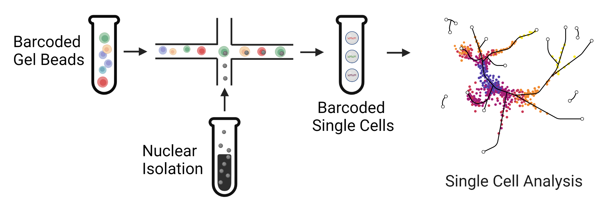


# Single Cell Multiomics  

|  |
|:--:| 
| Massively parallel high-throughput single cell sequencing can help to analyze thousands or even millions of cells in a single experiment. This approach helps to identify rare cell types and injured populations in kidney disease. |  

# Genetics at the Single Cell Level  

|  |
|:--:| 
| Single cell sequencing can be used to examine the effect of genetic variation on kidney disease. Single nucleotide variants can modify gene expression by altering the interactions between promoters and enhancers. |

