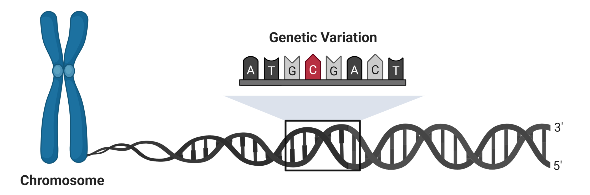
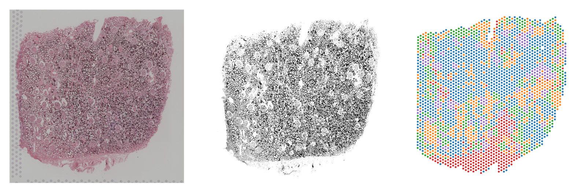


# Single Cell Multiomics

---

Massively parallel high-throughput single cell sequencing can help to analyze thousands or even millions of cells in a single experiment. This approach helps to identify rare cell types and injured populations in kidney disease.

  

# Genetics in Single Cells

---

Single cell sequencing can be used to examine the effect of genetic variation on kidney disease. Single nucleotide variants can modify gene expression by altering the interactions between promoters and enhancers.

  

# Spatial Profiling

---

Spatial profiling can be used to localize gene expression in the kidney. The location and expression pattern of injured kidney cells can give insight into the signaling pathways that promote disease progression.

  

# Join the Lab!

The Wilson laboratory is always looking for talented researchers and collaborators to join our team! Please send us an email or find us on social media to connect with the lab. We also have a list of [open positions](/_pages/positions.md) on our website.

